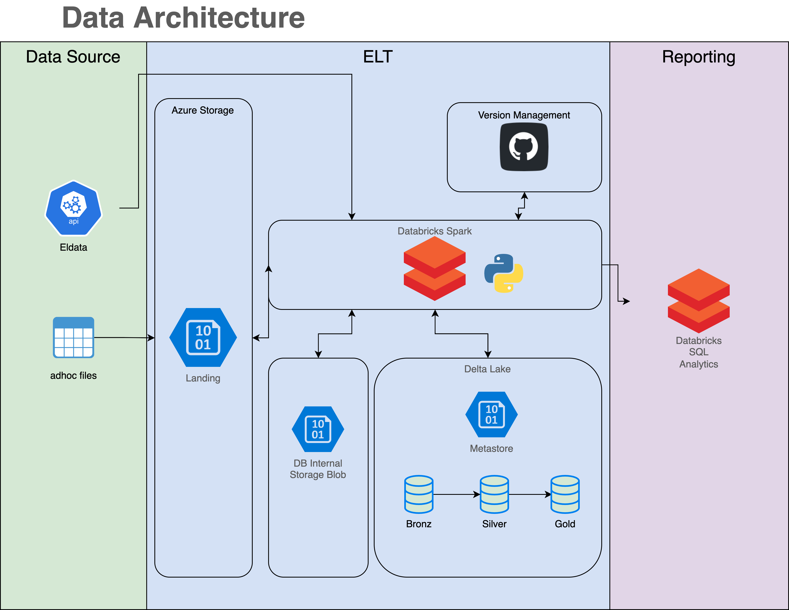

# Databricks övning akademi 2023

Det är denna ariktetkuren vi vill sätta upp

## Intro 

1. Skapa ett nytt Databricks workspace under emhol-rg.
[Azure portal](https://portal.azure.com/)

2. Skapa ett kluster i det nya workspacet.

## Del 1 - Brons
Följ instruktionerna i notebooken [del_1_bronze.py](del_1_bronze.py)

## Del 1 - Silver
Följ instruktionerna i notebooken [del_2_silver.py](del_2_silver.py)

## Del 1 - Guld
Följ instruktionerna i notebooken [del_3_gol.py](del_3_gold.py)

